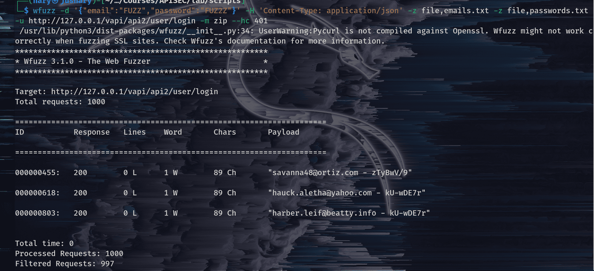
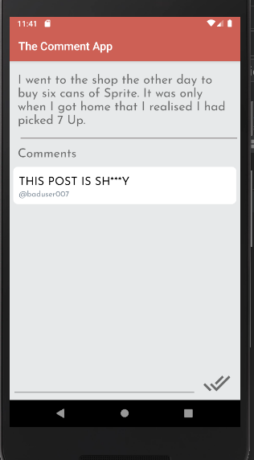
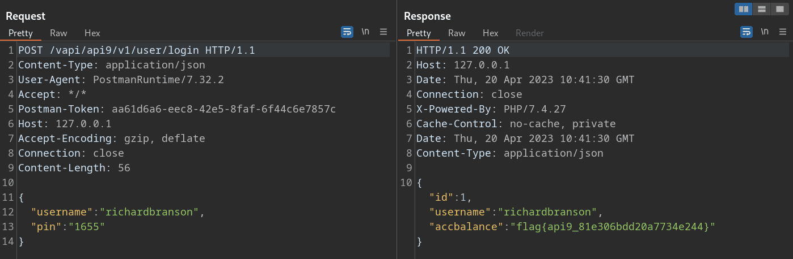

 
According to a Gartner report in 2020 **APIs account for 90% of the attack surface and are the most frequent attack vector.**

APIs often handle sensitive data, such as personal information, financial data, and intellectual property. If an API is not properly secured, this data can be easily accessed and stolen by hackers. In fact, some of the recent big data breaches have been due to under-protected APIs.

In this blog post, I am going to discuss OWASP top 10 API 2019 vulnerabilities by using VAPI. VAPI (Vulnerable Adversely Programmed Interface) refers to a PHP interface that can be hosted by the user. It is designed to provide exercises based on scenarios from [OWASP API Top 10 2019](https://www.google.com/url?sa=t&rct=j&q=&esrc=s&source=web&cd=&cad=rja&uact=8&ved=2ahUKEwiP2c7Wp83-AhWIy6QKHWKlBWYQFnoECA0QAQ&url=https%3A%2F%2Fowasp.org%2Fwww-project-api-security%2F&usg=AOvVaw1DKFIeXGQUpccFoTKm0QEt), aimed at simulating real-world situations.

We are going to use the following tools in this blog post:

-   Postman
-   Burp Suite
-   Wfuzz

Install VAPI from GitHub or use the one that is hosted at [http://vapi.apisec.ai/vapi](http://vapi.apisec.ai/vapi). Import the [VAPI collection](https://www.google.com/url?sa=t&rct=j&q=&esrc=s&source=web&cd=&cad=rja&uact=8&ved=2ahUKEwiRoqmVtM3-AhVCi_0HHezaDn8QFnoECA8QAQ&url=https%3A%2F%2Fwww.postman.com%2Froottusk%2Fworkspace%2Fvapi%2Foverview&usg=AOvVaw0w1XlQelSk7t_QEknHsy9I) into your postman. Also, this post assumes that you have a basic understanding of how to use Postman, Burp Suite, and the Linux operating system. Set Postman to proxy so that you can intercept requests in Burp Suite.


&nbsp;

## API1: 2019 Broken Object Level Authorization

This vulnerability occurs when APIs fail to enforce appropriate access controls for individual objects, resulting in unauthorized access and data leaks. This attack is also referred to as IDOR (Insecure Direct Object References) in regular web applications. In other words, a user can access other users' information simply by providing their IDs.

### How to exploit
Let's explore this vulnerability practically using VAPI

#### Step 1. 
VAPI collection in Postman, Create an account.

                        *Fig 1:1: POST request to vapi/api/user*
&nbsp;  

#### Step 2.
Retrieve the details of the account that we created by using its ID.(Fig 1:2)

**Provide the Authorization Token. Which is the base64 encode of `"Username:Password"`.**
```bash
# if you are using Linux use this command 
# echo -n "Username:Password" | base64
echo -n "Hello7070:hellow70" | base64
```

                                *Fig 1:2: GET request to vapi/api/user* 

#### Step 3. 
To check if you have access to view other users' details, you can change the ID to different id. For example, let's use `ID = 1`.(Fig 1:3)

                                          *Fig 1:3: GET request to vapi/api/user/1*
                                          
As you can see from the example above, by providing the ID of 1, we were able to view all the details of that account. Broken Object-Level Authorisation (BOLA) occurs when a user is authenticated, but there is no authorisation mechanism in place to verify whether the user has the necessary permissions to access the requested resources. 

### How to Prevent 

**To ensure secure access control, implement a proper authorisation mechanism, use it to check access, prefer GUIDs as IDs, and test and validate changes before deployment.**

For more about this vulnerability, check out  **[API1:2019 Broken Object Level Authorization](https://github.com/OWASP/API-Security/blob/master/2019/en/src/0xa1-broken-object-level-authorization.md)**

&nbsp;

## API2:2019 Broken User Authentication

API authentication can be a complex system that includes several processes with a lot of room for failure. A security expert Bruce Schneier said, “The future of digital systems is complexity, and complexity is the worst enemy of security.”

Broken user authentication refers to any weakness within the API authentication process. The weakness may either be lack of protection mechanism in authentication or implementation of the mechanism. 

### How to exploit

Let's explore more about this vulnerability using VAPI.


					Fig 2:1 login request.
					
From the above figure (Fig 2:1) we are presented with login credentials which are Email and Password. 

#### Step 1. 

Prepare wordlists for our brute force attack.

The wordlist we are going to use is available at [credentials](https://github.com/roottusk/vapi/tree/master/Resources/API2_CredentialStuffing). Please save the creds.csv file to your directory. We will be using wfuzz for brute forcing. 
Let's break the list into two parts: the email list and password list. Use `cut` command, specify the delimiter and field to extract emails and passwords from creds.csv file. 

To extract the emails, use the command `cut -d ',' -f 1 creds.csv > emails.txt`.

To extract passwords, use the command `cut -d ',' -f 2 creds.csv > password.txt`.

#### Step 2. 

It's time to start the brute force attack. There are different ways to achieve this; some may want to use the Intruder of Burp Suite or OWASP ZAP Fuzz, but I will be using wfuzz, a pre-installed fuzzing tool in Kali Linux.

The command is for wfuzz is
```
wfuzz -d '{"email":"FUZZ","password":"FUZ2Z"}' -H 'Content-Type: application/json' -z file,emails.txt -z file,passwords.txt -u http://127.0.0.1/vapi/api2/user/login -m zip --hc 401
```

Explanation of the command.

-   `wfuzz`: This is the name of the tool being used.

-   `-d '{"email":"FUZZ","password":"FUZ2Z"}'`: This option specifies the data to be sent in the HTTP POST request. The value "FUZZ" will be replaced by the emails wordlist to be tested,  and The value "FUZ2Z" will be replaced by the password wordlist to be tested

-   `-H 'Content-Type: application/json'`: This sets the HTTP header "Content-Type" to "application/json", indicating that the data being sent is in JSON format.

-   `-z file,emails.txt`: This option specifies that the tool should use a wordlist (in the file "emails.txt") for the "email" parameter in the data. The "FUZZ" value in the data will be replaced by each value in the email wordlist.

-   `-z file,passwords.txt`: This option specifies that the tool should use another wordlist (in the file "password.txt") for the "password" parameter in the data. The "FUZ2Z" value in the data will be replaced by each value in the password wordlist.

-   `-u http://127.0.0.1/vapi/api2/user/login`: This is the target URL for the login page. **change this to your target**

-   `-m zip`:  combining payloads

- `-hc 401`: Hides responses with HTTP status code of 401


                                     Fig 2:2 wfuzz output.

#### Step 3. 
Use the credentials we got from step 2 to login.

							Fig 2:3 POST vapi/api2/user/login$
#### Step 4. 
Use the token from step 3, into Authorization-Token for GET request to get details.(Fig 2:4)


                                             Fig (2:4)  GET request vapi/api2/user/details

From the above step, we are able to exploit broken user authentication and accessed user's private info. 

#### How to Prevent 

To ensure secure authentication, utilise established standards for authentication, token generation, and password storage, and treat credential recovery/forget password endpoints like login endpoints with anti-brute force mechanisms that are stricter than regular rate limiting. 

Learn more about this vulnerability at **[API2:2019 Broken User Authentication](https://github.com/OWASP/API-Security/blob/master/2019/en/src/0xa2-broken-user-authentication.md)**

&nbsp;

## API3:2019 Excessive Data Exposure

This can occur when an API endpoint responds with more information than is needed to fulfill a request, expecting the consumer to filter the results. This can be the equivalent of asking someone for their name and having them respond with their name, date of birth, email address, phone number, and the identification of every other person they know. This vulnerability can lead to data breaches, loss of trust, and financial loss.

### Let's explain this vulnerability using VAPI

#### Step 1.

In the Vapi resources, there is an APK. Copy it and install it in the Android emulator. Set your Android emulator's proxy settings to `127.0.0.1:8080` so that you can use Burp to intercept the requests


#### Step 2. 

Open the application and input the base URL. While adding the base URL in the APK, add it like this:
- baseurl/vapi
- If your base url is `http://127.0.0.1` Add it like `http://127.0.0.1/vapi`
- If you are using the Android emulator, and you are running Vapi locally, the base URL is `http://your machine IP address`. For example, if the IP address of the machine where both the Android emulator and Vapi run locally is 192.168.1.22,then the baseurl is `http://192.168.1.22/vapi`

For example, this is my emulator, and I can access the Vapi lab using my IP address.


This is the screenshot of baseURL/vapi.


#### Step 3.
Create an account.


Intercept request and response in burp

- From the above results, account is created, and our our "ID" is 3


#### Step 4.
After signing up, log in to the app.

Let's see the login using postman


After logging into the app, this is the screen we are presented with.

- In the above screen, create a new comment

#### Step 5.
After signing in, we automatically get this request `GET /vapi/api3/comment`.

From the above response:
-   The data we received back is more than what we were supposed to get.
-   We asked for a comment, but instead, we got back the device ID, latitude, and longitude of the user who wrote the comment. The above scenario happened because the developer didn't filter sensitive data and relied on the client. 

#### How to Prevent.
To prevent excessive data exposure through APIs, avoid relying on client-side filtering, review API responses, consider the consumer before exposing new endpoints, cherry-pick specific properties, classify sensitive information, and implement schema-based response validation.

Learn more about this vulnerability at  **[API3:2019 Excessive Data Exposure](https://github.com/OWASP/API-Security/blob/master/2019/en/src/0xa3-excessive-data-exposure.md)**

&nbsp;

## API4:2019 Lack of Resources & Rate Limiting

A lack of resources and rate limiting are two related concepts that are commonly encountered in the context of application programming interfaces (APIs).

A lack of resources refers to a situation where an API or the underlying infrastructure is unable to handle all of the requests that are being made to it due to insufficient resources, such as processing power, memory, or bandwidth. This can lead to slower response times, dropped requests, or even system crashes. An attack may send an many requests to the api end-point and cause the DoS (Denial of service attack)

Rate limiting, on the other hand, is a mechanism used by APIs to restrict the number of requests that can be made within a given time period, usually to prevent overloading the system or to prevent abuse like bruteforcing. The API provider will typically define a set of rules that govern how many requests can be made within a given time frame (e.g., 5 requests per minute), and any requests that exceed this limit will be rejected or delayed. If rate limiting is not set especially  to end-points that involves authentications, the attacker may bruteforce login or password reset functionality and gain access. 

 
### Lets see how to exploit this vulnerability using VAPI - API4 

#### Step 1. 
Open API4 in VAPI collection

- We have three requests: "POST Mobile Login", "POST Verify OTP", and "GET Get Details."

#### Step 2.
On the first request ("POST Mobile Login"), send a request.

-   As we can see, the request was successful.
-   The response shows that we have to provide a 4-digit OTP sent to the mobile number: `"msg": "4 Digit OTP sent on mobile no."`


#### Step 3.
On the second request (`"POST" Verify OTP`). Send request on postman through burp suite. 

-   A 403 Forbidden response was returned, meaning the OTP provided is invalid.
-   There is no rate limiting on the response.


#### Step 4.
Since there is no rate limiting, it's time to brute-force the OTP. The OTP is four digits (from the request "otp":"9999"), meaning the OTP will be between 0000 and 9999.

- Let's create a wordlist of numbers containing all numbers from 0000-9999 using python. 
```python
numbers = list(range(0000,10000))

with open('numbers.txt', 'w') as f:
	for num in numbers:
		f.write(str(num) + '\n')
```

- After having a wordlist, we will use wfuzz to brute-force the OTP. (There are a variety of different other tools for brute-forcing like ffuf and Intruder). The reason we are using wfuzz and not Burp Intruder is that wfuzz is faster than Intruder in Burp community edition.

The wfuzz command is 
``` 
wfuzz -d '{"otp":"FUZZ"}' -H 'Content-Type:application/json' -z file,numbers.txt -u http://127.0.0.1/vapi/api4/otp/verify --hc 403
```
 - In the above command, please change `numbers.txt` to the name of your wordlist, unless you used the above python script.
 - change the URL (http://127.0.0.1) to yours.
 

From the above result
- The `OTP` is `1872`

#### Step 5. 
In repeater Burp Suite or Postman, on the "POST Verify OTP" request, provide the OTP we got from the above step and send the request.

- We got 200 OK responce and,
- We got the key. 

#### Step 5.
On the third request (`"GET" Get Details`), In postman, put the key from above step to  Authorization-Token (`{{api4_key}}`)


After providing the key value of Authorization-Token, send the request.


We can see the postman responce below. 

- The 200 Ok responce was returned
- We are able to login as John despite not having john mobile number. 
- And we have the flag.

The responce in Burp suite.

- we have successfully exploited this vulnerability. 

#### How to Prevent.
To prevent lack of resources and rate limiting in APIs, measures such as limiting resource usage, implementing rate limiting, adding server-side validation, and defining maximum data size can be taken

For more about this vulnerability, check out **[API4:2019 Lack of Resources & Rate Limiting](https://github.com/OWASP/API-Security/blob/master/2019/en/src/0xa4-lack-of-resources-and-rate-limiting.md)**

&nbsp;

## API5:2019 Broken Function Level Authorization

Exploitation involves an attacker sending valid API calls to endpoints they should not have access to, which can be discovered more easily in APIs due to their structured nature. Authorisation checks for functions or resources are often managed through configuration and can be complex to implement properly. These flaws can give attackers access to unauthorised functions, with administrative functions being a common target.

Some common flaws that can lead to unauthorised access include:

1.  Predictable resource locations: If resource locations are predictable or easily guessable, it may be possible for an attacker to access resources that they are not authorised to access.
    
2.  Insufficient access controls: If access controls are not properly implemented, it may be possible for an attacker to bypass them and gain access to restricted resources.


#### How to exploit.

Step 1.
-  In the Postman API collection, expand API 5.
-  Create an account using `POST /vapi/api5/user`.

Here's a screenshot of the Postman showing the account creation and response:


#### Step 2. 
-   Send a login request using `GET /vapi/api5/user/id`.
-   Put the username and password in the login body.
-   Use the ID from the account creation response and put it in the ID placeholder in the request `GET /vapi/api5/user/2`.
-   Put the Authorization-Token in the {api5_key} value. The token is the base64 encode of `username:password`. Change the username and password details to the details you used to create the account. You can use an online application to base64 encode the login credentials, or you can use the Linux command `echo -n "username:password" | base64`.

Copy the token above and put it in the Authorization-Token value, then send the request.
![[Pasted image 20230419141558.png]]
As we can see from the above, 
-   We can see that we have our account details.
-   We are authenticated, and to access our data, we have to provide the username and password.

Let's test the authorization functions.

#### Step 3.
Since the above request is `GET /vapi/api5/user/id`, let's try sending API requests to different endpoints. We can test `GET /vapi/api5/user/admin`, `GET /vapi/api5/user/admins`, `GET /vapi/api5/admin`, `GET /vapi/api5/users`, and so on, depending on the generic naming convention of other previous endpoints. 

We can see that in the endpoint `GET /vapi/api5/users`, we get the following response in:-

Postman 

Burp 

- From the responses above, we can see that we are able to see privileged information, which are admin info. For more information about BAFLA, watch SANS Offensive Operations YouTube video titled ["Analyzing The OWASP API Security Top 10 For Pen Testers"](https://youtu.be/5UTHUZ3NGfw)).

#### How to Prevent
To secure an application, enforce denial of all access by default, review API endpoints for authorisation flaws, and implement authorisation checks based on user group/role. Administrative controllers should inherit from an administrative abstract controller, and administrative functions in regular controllers should also implement authorisation checks based on user group/role.

Learn more about this vulnerability at **[API5:2019 Broken Function Level Authorization](https://github.com/OWASP/API-Security/blob/master/2019/en/src/0xa5-broken-function-level-authorization.md)**

&nbsp;

## API6:2019 Mass Assignment

Mass Assignment occurs when an API consumer includes more parameters in
their requests than the application intended and the application adds these
parameters to code variables or internal objects. Understanding the business logic, objects' relations, and the API structure is typically necessary for exploitation. APIs make it easier to exploit mass assignment because they expose the application's underlying implementation and the names of its properties.

To streamline development, modern frameworks often provide functions that automatically connect input from clients to code variables and internal objects. Unfortunately, attackers can take advantage of this approach to alter or replace properties of sensitive objects that developers never meant to reveal.

### Let's explore this vulnerability using VAPI.

#### Step 1. 
- On Postman VAPI collection, expand API6.
- There are two requests, `POST Create User` and `GET user`
- On the first request, `POST Create User`, create a user by filling the information required.

Postman request and response. 


Burp's request and response


#### Step 2. 
- On Second request, `GET Get User`, 
- Provide the Authorization-Token. Again, this token is the value of base64 encode of `username:password`. You can use linux command `echo -n "username:password" |base64`
- Change the username and password above to the one you used to create an account in the first step.
- Put the token into the Authorization-Token value field and send the request.

Postman request and response.


Burp suite request and response.


- From the above responses, both Postman's and Burp Suite's, we can see that there is an additional field which is `"credit":"0"`.

#### Step 3.
Let's try to create a new account but this time, set the `"credit"` to any number.

Let's set the credit to 20.

The request and response on postman


The request and response in Burp suite
![[Pasted image 20230419143922.png]]
From the above,
- We got the 200 response, meaning the request was successful
- The id is 4

#### Step 4.
Let's request the details of our new account. Remember to base64 encode the "username:password" and use it as the Authorization-Token.

As we can see, the credit is set to the number that we set while creating an account in the above step.

#### Step 5.
Let's create a new account, and this time set the credit to 200.

In Postman


In Burp Suite


- After creating the account, encode "username:password" (the new username and password) using base64 and set it as the Authorization-Token.

Request and response in postman


Request and response in Burp suite

- From the above output, we have successfully exploited this vulnerability. 
- We have set our credit to 200. 

#### How to Prevent this vulnerability according to OWASP.

-   If possible, avoid using functions that automatically bind a client’s input into code variables or internal objects.
-   Whitelist only the properties that should be updated by the client.
-   Use built-in features to blacklist properties that should not be accessed by clients.
-   If applicable, explicitly define and enforce schemas for the input data payloads

For more information about this vulnerability, check out **[API6:2019 Mass Assignment](https://github.com/OWASP/API-Security/blob/master/2019/en/src/0xa6-mass-assignment.md)**

&nbsp; 

## API7:2019 Security Misconfiguration

API security misconfigurations can occur at any level, leaving the system vulnerable to unauthorised access or exposure of sensitive data. Attackers will often search for unpatched flaws, unprotected files and directories, or common endpoints to exploit these misconfigurations. These vulnerabilities can be present at the network or application level and can be detected and exploited using automated tools. If left unaddressed, security misconfigurations can lead to serious consequences such as unauthorised access to sensitive user data or full server compromise.

According to OWASP, the API might be vulnerable to security misconfiguration if:

-   Appropriate security hardening is missing across any part of the application stack, or if it has improperly configured permissions on cloud services.
-   The latest security patches are missing, or the systems are out of date.
-   Unnecessary features are enabled (e.g., HTTP verbs).
-   Transport Layer Security (TLS) is missing.
-   A Cross-Origin Resource Sharing (CORS) policy is missing or improperly set.
-   Error messages include stack traces, or other sensitive information is exposed.

### Exploring this vulnerability using VAPI.

#### Step 1. 

This lab has improperly CORS set. Cross-Origin Resource Sharing (CORS) is a security mechanism implemented in web browsers that allows a server to specify which origins are permitted to access its resources. This is done to prevent malicious scripts on unauthorised domains from accessing sensitive data or performing unauthorised actions on behalf of a user. CORS is enforced by the browser and is based on HTTP headers exchanged between the client and server. In summary, CORS ensures that web applications are accessed only from trusted sources and reduces the risk of unauthorised access and data leakage.


Let's see this in VAPI collection API7.
We see there are four requests which are `POST: Create User`, `GET Login`, `GET Key`, `User Logout` 

- On the first request, create a new account. 


#### Step 2. 
On the second request (`GET Login`), login using the created credentials above. Again, the Authorization-Token value is encoded as "username:password" using base64.

- We are now logged in.

#### Step 3. 
On the third request (`GET Key`), since we are logged in, send the request.

Request and response in Burp suite


Request and response in Postman
![[Pasted image 20230419151420.png]]
From the above response, 
- There are two most important pieces of information: `Access-Control Allow-Origin *` and `Access-Control Allow-Credentials: true`.


#### Step 4.

On the request, let's add `Origin:` and put a domain that we control. For this lab use any domain. Let's use `hellow.com`
`Origin: hellow.com` and send the request. 

- From above response, our site `hellow.com` is accepted `Acess-Control Allow-Origin: hellow.com`
- We have the flag as well. 
- We have successfully exploited the security misconfiguration of this site.

### How to Prevent

According to OWASP, use the following techniques to prevent this vulnerability from happening. 
-   A repeatable hardening process leading to fast and easy deployment of a properly locked down environment.
-   A task to review and update configurations across the entire API stack. The review should include: orchestration files, API components, and cloud services (e.g., S3 bucket permissions).
-   A secure communication channel for all API interactions access to static assets (e.g., images).
-   An automated process to continuously assess the effectiveness of the configuration and settings in all environments.

More about security misconfigurations, check out **[API7:2019 Security Misconfiguration](https://github.com/OWASP/API-Security/blob/master/2019/en/src/0xa7-security-misconfiguration.md)**

&nbsp; 

## API8:2019 Injection

API injection attacks occur when attackers exploit vulnerabilities in an API by feeding it with malicious data through various injection vectors such as direct input, parameters, or integrated services. The malicious data is then sent to an interpreter, which processes the input and executes the corresponding operation. However, if the API is not properly secured, the interpreter may misinterpret the input and execute unintended commands. Injection flaws are prevalent in various technologies, including SQL, LDAP, or NoSQL queries, OS commands, XML parsers, and ORM. Such flaws can lead to severe consequences such as information disclosure, data loss, denial of service (DoS), or even complete host takeover.

### Exploring the Practical Implications of this Vulnerability

#### Step 1. 

On VAPI collection in Postman, try logging in using any credentials and check the error message. For example, let's use 'admin' and 'password' as the username and password.

In Postman


in burp

- From the above response, the credentials are incorrect.

#### Step 2. 
Since it accepts input for login, let's try to check if the sign-in is vulnerable to SQL injection.

Put the single quote `(apostrophe ')` in the login field. This is because the SQL command uses a single quote to enclose the string literals or character data.

Example.
```sql
SELECT * FROM users WHERE username = 'username' AND password = 'password';

```
When we put a single quote in either the username field or password field, if the page is not vulnerable, it should handle it like any other character. But if the page is vulnerable, it will try to enclose the syntax and then throw an error.

Let's try this on both the username and password fields in Postman and Burp Suite.

Trying apostrophe (`'`)on the username field. 

Result in burp


Results in postman. 


From the above results, we can conclude that the username field is vulnerable to SQL injection since it threw an error.

#### Step 3. 

Let's try to use the above methodology to see if the password field is vulnerable to SQL injection by inserting an apostrophe.

Result in burp


Results in postman. 

- From the above results, we can conclude that the password field is also vulnerable to SQL injection. 

#### Step 4.

Time to exploit the vulnerability.

Since this is a SQL vulnerability, from the example command above:
```sql
SELECT * FROM users WHERE username = 'username' AND password = 'password';
```
Let's try to make the condition true using `' OR 1=1 #`

- The single quote `'` encloses the string literals.
-  Then `OR` is a logical operator that is used to combine multiple conditions in the WHERE clause. This means that the syntax will be true if one of the conditions is true.
-  `1=1` is the second condition, which is true. And because it is true, the command syntax will be true.
-  `#` the hash symbol is used for commenting out the rest of the syntax of the command in MySQL databases. Try different commenting symbols like `--` to understand more about SQL.

**If you are new to SQL injection, I would advise you to take a few minutes to get to know about SQL injection. Some great resources are [Portswigger Academy](https://portswigger.net/), [Raha Khalil's YouTube channel](https://www.youtube.com/watch?v=1nJgupaUPEQ&list=PLuyTk2_mYISLaZC4fVqDuW_hOk0dd5rlf), and [Tib3rius's YouTube channel](https://youtu.be/AEaW8_T0xmY).**

Let's see the result in Burp by providing `' OR 1=1 #` to the username field. 

- We have successfully obtained the authkey.

Let's provide the same payload into the password field.

- Again, we have successfully obtained the authkey.


#### Step 5.

In the `GET Secret` request of Postman's VAPI collection, provide the authkey obtained from the previous step in the `Authorization-Token` field and send the request.

Results in postman


Results in Burp suite.

- As you can see, we have successfully solve the lab and logged in as admin. 
- We have successfully exploited injection vulnerability. 

#### Best Practices for Preventing API Injection Attacks.
To prevent API injection attacks, it is important to perform data validation using a trustworthy library, validate and sanitize all client-provided data, escape special characters, use a parameterized interface, limit returned records, filter incoming data, and define data types and strict patterns for string parameters.

For more about this vulnerability, check **[API8:2019 Injection](https://github.com/OWASP/API-Security/blob/master/2019/en/src/0xa8-injection.md)**

&nbsp;

## API9:2019 Improper Assets Management

This vulnerability happens when Old API versions are unpatched and all other vulnerabilities that are patched in new versions still exists in old ones and both versions are connected to the same databases. Example two versions connected on same database, in version 2 there is rate limiting in place but version one there isn't. An attack can bruteforce version 1 and get into the system since there is no rate limiting to prevent bruteforce from happening. 

Attackers may gain access to sensitive data, or even takeover the server through old, unpatched API versions connected to the same database.


### Let's see the exploitation of this vulnerability practically using VAPI.

#### Step 1. 
From the VAPI collection in Postman, there is a login request where we have the username called "richardbranson" and a PIN that was sent to the user's phone number. 


Let's try putting any four digits to see the response. Let's try 1234.

- From the above result, there are two interesting pieces of information which are "X-RateLimit-Limit: 5" and "X-RateLimit-Remaining: 4". 
- This means that there is rate limiting in place and if we try to brute force and exceed five times, we won't be able to reach the server. 

We can see the above explanation in the following results in Burp.

- The above result shows that we have `X-RateLimit-Remaining: 1`

After exceeding the rate limit, we get a 500 status code. 


#### Step 2. 
The above request on `POST /vapi/api9/v2/user/login` is protected against brute forcing. But because the request has `v2` in it, we can assume that it represents version 2. Let's see version 1 at `POST /vapi/api9/v1/user/login`

- From the output above, not only does this request return a 200 status code, but in the response it has no rate limiting in place. This is because the developer abandoned the `v1` API once the `v2` was in place. 

#### Step 3. 
Since there is no rate limiting in place, lets try to get the PIN that was sent to the user's phone number. 

- Again, we are using wfuzz because it's free and faster compared to Burp Intruder in the community edition. Also, it comes pre-installed in Kali Linux.
- We are using the same wordlist we created in "API4:2019 Lack of Resources & Rate Limiting" section. 
The command for wfuzz is
```
wfuzz -d '{"username":"richardbranson", "pin":"FUZZ"}' -H 'Content-Type:application/json' -z file,numbers.txt -u http://127.0.0.1/vapi/api9/v1/user/login --hh 0 -t 100
```
The "--hh 0" means hide responses with zero (0) characters. 
"-t 100" uses 100 threads.


- From the above command output, the PIN is "1655".

#### Step 4.
Back to either Postman or Burp Suite, let's log in using the above PIN..

Using Postman


Using burp suite

- From the above results, we have successfully logged in
- We have successfully exploited the improper assignment vulnerability. 

### How to Prevent 
To ensure API security, inventory and document all hosts and integrated services, document all aspects of your API, generate documentation automatically, use external measures like API security firewalls, avoid using production data with non-production deployments, and perform a risk analysis when updating versions.

Learn more about this vulnerability at **[API9:2019 Improper Assets Management](https://github.com/OWASP/API-Security/blob/master/2019/en/src/0xa9-improper-assets-management.md)**

&nbsp;

## API10:2019 Insufficient Logging & Monitoring

The lack of logging and monitoring makes it easy for attackers to abuse systems without being detected, as suspicious activities cannot be tracked and responded to in a timely manner. This gives attackers ample time to fully compromise the systems without being detected.

vapi collection in Postman, send the request.

The below output is the flag for vapi/api10. This is just showing that all the testing was not monitored or logged. That is the vulnerability in itself.  

Output in Postman


Output In Burp Suite.


### How to prevent this vulnerability.
To enhance API security, it's important to log failed authentication attempts and input errors, maintain log integrity, and monitor the system with a SIEM tool. Custom alerts and dashboards can help detect suspicious activity.

For more about this vulnerability check out **[API10:2019 Insufficient Logging & Monitoring](https://github.com/OWASP/API-Security/blob/master/2019/en/src/0xaa-insufficient-logging-monitoring.md)**

&nbsp;

## In conclusion. 

The OWASP API Security Top 10 2019 highlights the most critical API security risks that developers and organizations should be aware of. However, with the 2023 update currently in preparation, it's important to stay up-to-date on the latest API security best practices. 

Fortunately, there are several resources available to help you deepen your knowledge of API security, including the [APISec University]((https://www.apisecuniversity.com/)) and the book "[Hacking APIs]((https://www.amazon.com/Hacking-APIs-Application-Programming-Interfaces/dp/1718502443))" by Corey J Ball. Additionally, the OWASP website provides valuable information on the current state of API security, including the previous Top 10 list. 

Finally, keeping up with industry experts like Alissa Knight can provide valuable insights and perspectives on API security. By utilising these resources and staying informed, you can better protect your APIs against emerging threats and ensure the security of your organisation's data.


