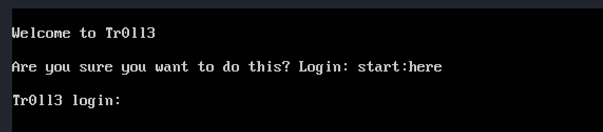
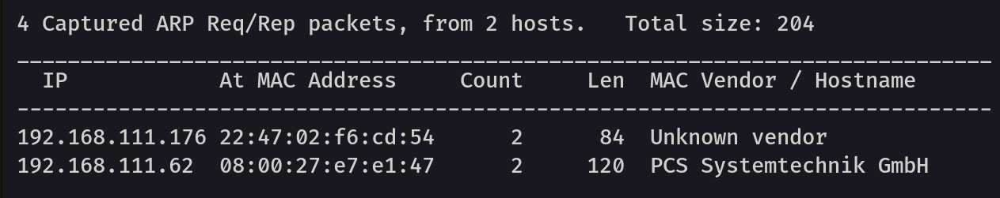
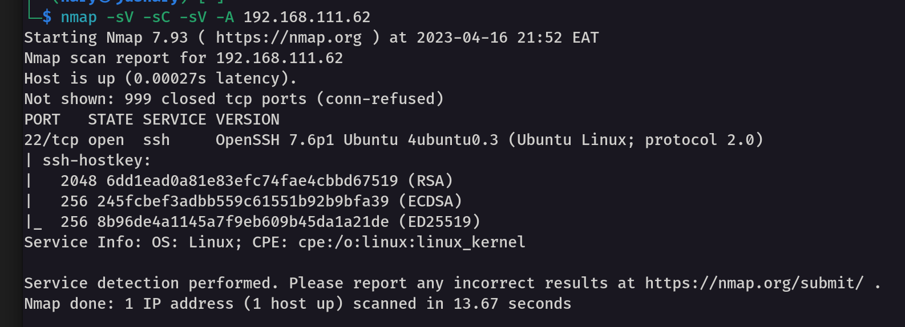
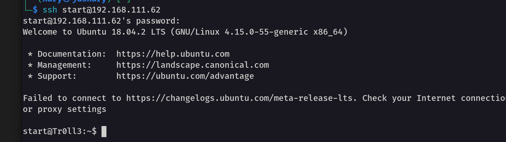
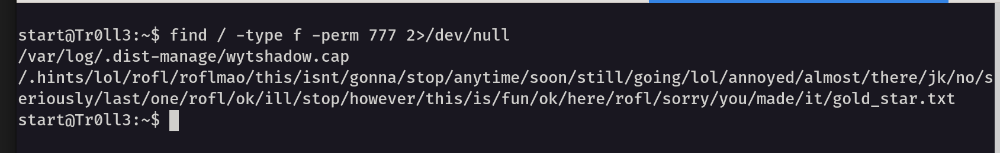

First step. 
Recon
Once you first run the tr0ll3 machine in the VM, it displays the following welcome message

According to the message that the machine displays, Logins credentials are `start:here`

Get the IP address.
From the linux machine, run `netdiscover` command to discover the ip address of the Tr0ll3. 

After getting the ip address, it is time to run nmap scan to dicover open ports, os
run `nmap -sV -sC -A ip` 

From the above nmap scan, here are takeaways.
- The only open port is 22 (ssh)
- The version of ssh is OpenSSH 7.6p1

Gaining access. 
SInce only `port 22 is open`, and we have login credintials from the welcome message, lets try to ssh into the machine. 
username:password  `start:here`
`ssh start@192.168.111.62`

Recon into the machine
For the sake of time, we are going to focus on redpill directory. Despite the bluepill directory being a dead end, take your time to navigate into the directory and unshorten the link to see where it takes you. As in the movie Matrix, `Neo, Follow the white rabbit`

For the redpill directory, we can see the username and password but once we try to ssh into the target using those credentials, it doesn't work. 

Step . 
Find files that we can access by running the following command
`find / -type f -perm 777 2>/dev/null`. We use `2>/dev/null` to get a clean output and not return any errors. 

From the above results, we have two files
`wytshadow.cap`  and `gold_star.txt`

Step 
Download them into our machine for more information gathering. 
1.  Use `scp` command to copy files into our machine. 
-  `scp start@192.168.111.62:/var/log/.dist-manage/wytshadow.cap .`
![[Pasted image 20230416224315.png]]
- `scp start@192.168.111.62:/.hints/lol/rofl/roflmao/this/isnt/gonna/stop/anytime/soon/still/going/lol/annoyed/almost/there/jk/no/seriously/last/one/rofl/ok/ill/stop/however/this/is/fun/ok/here/rofl/sorry/you/made/it/gold_star.txt .`
![[Pasted image 20230416224345.png]]

Investigate the files we downloaded

The first file is `wytshadow.cap` and we can use wireshark or tcpdump to analyse this file. 
let's read the file using `tcpdump` 

Run ` tcpdump -nnttttAr wytshadow.cap | less` 
(The `-nn` , port number shouldn't resolve to the names, `tttt` means show the date into human readable format)

![[Pasted image 20230416230211.png]]
- From the above output, we have Initializaiton vector used in a encryption of wireless network.
Let's use wireshark
![[Screenshot from 2023-04-16 23-00-45.png]]

From `tcpdump` and `wireshark`, we can see `Data IV / 802.11` which means the packet is carrying encryption keys.

The second file `gold_star.txt`
![[Pasted image 20230416230756.png]]
The file seems like different passwords. Which means gold_star.txt is the wordlist. 

Step --
Since we have the .cap file and a wordlist, let's use aircrack-ng to crack the password.

`aircrack-ng -w gold_star.txt wytshadow.cap ` 

![[Pasted image 20230416232229.png]]
From the above output, the password is gaUoCe34t1.

Step ---
Since the we had two files wytshadow.cap and gold_star, we can assume wytshadow is the name. Let's use ssh to login into the machine.
`ssh wytshadow@192.168.111.62` and password is `gaUoCe34t1.`
![[Pasted image 20230416232410.png]]
- We successfully loged in the system. 

Step ---
Time to look around and gather infomation about the user. Like listing files by using `ls`
![[Pasted image 20230416232516.png]]
- From the above output, there is `oohfun` file. 
- Run `file` command followed with the name of the file to see the type of file. From the above output of the `file oohfun` command, we see it's executable.
- Execute the file. `./oohfun`
- As we see from the above output, the file just prints `iM Cr@zY Lik3 AAA LYNX` mutliple times.
- Wh

![[Pasted image 20230416232616.png]]

![[Pasted image 20230416233016.png]]
![[Pasted image 20230416233141.png]]

![[Pasted image 20230416233213.png]]
sudo service nginx start, netstat -antp
![[Pasted image 20230416233533.png]]

lynx http://192.168.111.62:8080  genphlux:HF9nd0cR!
![[Pasted image 20230416233855.png]]

![[Pasted image 20230416234025.png]]

![[Pasted image 20230416234342.png]]

![[Pasted image 20230416234759.png]]

![[Pasted image 20230416235023.png]]
![[Pasted image 20230416235444.png]]   B^slc8I$
![[Pasted image 20230417000240.png]]

![[Pasted image 20230417000400.png]]

